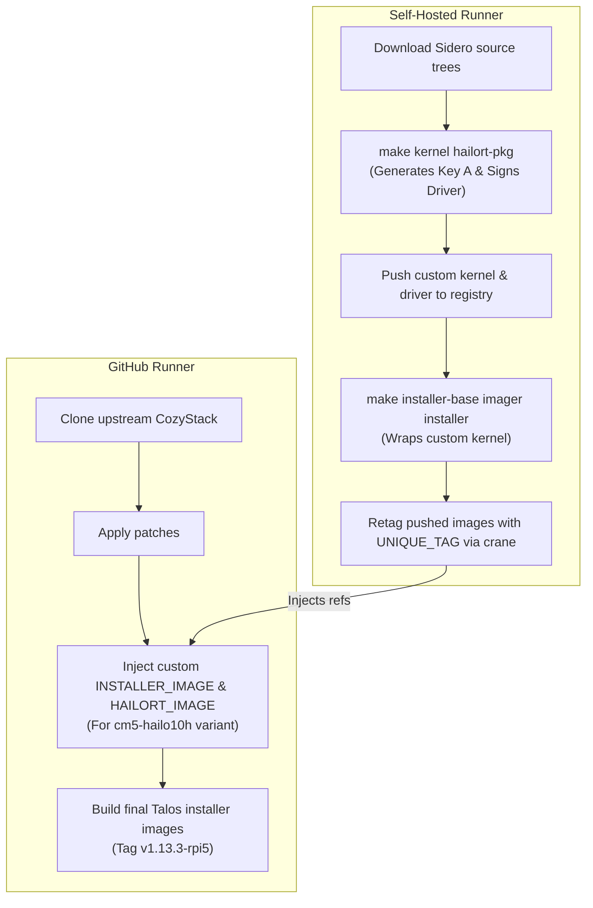

# CONTEXT HAND-OFF: HailoRT v5.3.0 Upgrade & Sovereign OS Factory (Part 2)

**Date:** June 20, 2026
**Current Branch:** `feat/sovereign-os-factory`

---

## 🚀 Project Goal & Journey Summary

The primary objective is to successfully upgrade the Talos Linux HailoRT extension to **v5.3.0** to support the **Hailo-10H AI accelerator** (Raspberry Pi AI HAT+) within the CozyStack Moon-and-Back project. This requires building custom, cryptographically signed driver modules and upgrading the Raspberry Pi 5 (CM5) nodes without security or boot failures.

Over the last two days, we designed and implemented the **Sovereign OS Factory** (Tier 1 of the build pipeline) and resolved critical hurdles around version compatibility, build caching, and cryptographic signature alignment.

---

## 🚧 Key Challenges & Solutions Implemented

### 1. Talos Installer Naming & Upgrade Blocker
*   **Challenge**: Upgrades to the custom-built installer failed with the error:
    ```
    Error: pre-flight checks failed: upgrades to version 5.3.0-v1.13.3-3d4c9177e9d4 are not supported
    ```
    This occurred because Sidero's Makefiles compile the value of the `TAG` variable directly into the installer binaries. Passing our content-hashed `UNIQUE_TAG` made the binary report a complex version that Talos's upgrade pre-flight checks rejected.
*   **Solution**: Modified [hack/build-sovereign-os.sh](file:///Users/yebyen/u/c/cozystack-moon-and-back/hack/build-sovereign-os.sh) to compile with `TAG="$TALOS_VERSION"` (i.e., `v1.13.3`). Once pushed to GHCR, the script queries the image digests and uses `crane tag` to explicitly tag them with the content-hashed `UNIQUE_TAG`. This preserves both standard version compliance inside the binaries and immutable caching in the registry.

### 2. Operationalizing Persistent Buildx Caching
*   **Challenge**: The original local folder cache (`/tmp/buildx-cache/...`) was a cache miss on every run. The Buildx builder container runs as an isolated sibling container on the host Docker daemon, meaning it had no access to the runner container's local `/tmp` directory. Furthermore, the builder container was destroyed at the end of every workflow run.
*   **Solution**: 
    1. Named the builder container `sovereign-builder` and configured it with `cleanup: false` and `keep-state: true` in [.github/workflows/build-talos-images.yml](file:///Users/yebyen/u/c/cozystack-moon-and-back/.github/workflows/build-talos-images.yml#L248-L255) to persist it between runs.
    2. Removed the directory-based `CI_ARGS` cache configurations. Buildx now natively and automatically manages caching internally inside the persistent `sovereign-builder` container volume.

### 3. Non-deterministic Make variables causing Cache Invalidation
*   **Challenge**: Sidero's Makefiles dynamically set `SOURCE_DATE_EPOCH` and `TAG` using the local git commit timestamp/status. Since the build script dynamically ran `git init` and `git commit` to apply patches on every execution, these variables changed every run, invalidating BuildKit's cache and causing a full 1h 45m kernel compilation.
*   **Solution**: Passed `SOURCE_DATE_EPOCH=1716646524` and `TAG="$TALOS_VERSION"` explicitly as command-line arguments to all Sidero `make` calls in `build-sovereign-os.sh`. This ensures all build arguments are deterministic, yielding 100% cache hits.

### 4. Cryptographic Module Signing Key Mismatch ("key was rejected by service")
*   **Challenge**: Talos Linux enforces strict module signing (`module.sig_enforce=1`). The kernel compilation generates a fresh, ephemeral private signing key on every compile. Because we were only building the `kernel` target in Step 1, the `hailort-pkg` target (containing the actual compiled `.ko` driver modules) was being pulled as a stale/unsigned image from the registry. The booted kernel (Key A) rejected the module signed with a mismatched key (Key B), resulting in the boot log error:
    ```
    error loading module "hailo1x_pci": load hailo1x_pci failed: key was rejected by service
    ```
*   **Solution**: Modified Step 1 of [hack/build-sovereign-os.sh](file:///Users/yebyen/u/c/cozystack-moon-and-back/hack/build-sovereign-os.sh#L118) to build both `kernel` and `hailort-pkg` in the same invocation:
    ```bash
    $MAKE_CMD kernel hailort-pkg REGISTRY="$REGISTRY" USERNAME="$USERNAME" TAG="$PKG_VERSION_TAG" PUSH=true PLATFORM=linux/arm64
    ```
    This guarantees that the driver module is compiled against the newly generated kernel headers and signed with the exact private key matching the booted kernel.

### 5. Kubelet CPU Manager Boot Failure & Talos Fallback Revert
*   **Challenge**: Upon boot of the upgraded image, Kubelet failed to start with:
    ```
    start cpu manager error: current set of available CPUs "0" doesn't match with CPUs in state "0-3"
    ```
    This occurred because Kubelet has a persistent CPU state checkpoint file (`/var/lib/kubelet/cpu_manager_state`) on the node's local storage. When the upgraded kernel booted, only CPU 0 was brought online during early initialization (or Kubelet started before other cores initialized). Detecting a mismatch from `0-3` down to `0`, Kubelet failed, causing Talos to mark the boot as failed and automatically roll back (revert) to the old working partition (which then triggered module signature errors because it ran the old kernel).
*   **Solution**: Deleting the Kubelet CPU Manager checkpoint state file allows Kubelet to re-detect all available cores on boot.

---

## 🏗️ Architectural Overview



---

## ✅ Current State of the Code & Next Steps

All changes are committed and pushed to the remote branch `feat/sovereign-os-factory`.

> [!IMPORTANT]
> The next build triggered on the `feat/sovereign-os-factory` branch will hit the persistent cache inside the `sovereign-builder` container, making it extremely fast.

### Recommended Next Steps:

1.  **Monitor the next CI Run**: Run a test commit or trigger the workflow on `feat/sovereign-os-factory` to verify cache hits and image tag synchronization.
2.  **Delete Kubelet State on Node**: Before/during upgrade of the node, remove the CPU Manager checkpoint file to prevent Kubelet restart loops and Talos fallback rollbacks:
    ```bash
    # Run a privileged shell/command to remove the Kubelet checkpoint state:
    rm -f /var/lib/kubelet/cpu_manager_state
    ```
3.  **Upgrade Node**: Run the upgrade:
    ```bash
    talm upgrade -f nodes/node9.yaml -i ghcr.io/urmanac/cozystack-assets/talos/cozystack-spin-hailort-cm5-hailo10h/talos:v1.13.3-rpi5
    ```
4.  **Confirm Driver Loading**: Verify the `hailo1x_pci` driver loads successfully without key rejection logs.

---

## 📚 Key Files Modified/Created

*   [hack/build-sovereign-os.sh](file:///Users/yebyen/u/c/cozystack-moon-and-back/hack/build-sovereign-os.sh): Added deterministic variables (`SOURCE_DATE_EPOCH`, `TAG`), aligned module signing targets, and implemented Crane retagging.
*   [.github/workflows/build-talos-images.yml](file:///Users/yebyen/u/c/cozystack-moon-and-back/.github/workflows/build-talos-images.yml): Configured persistent Buildx builder (`sovereign-builder`) with `cleanup: false` and `keep-state: true`.
*   [docs/SESSION-LOG-HAILORT-UPGRADE.md](file:///Users/yebyen/u/c/cozystack-moon-and-back/docs/SESSION-LOG-HAILORT-UPGRADE.md): Logs historical and active progress.
