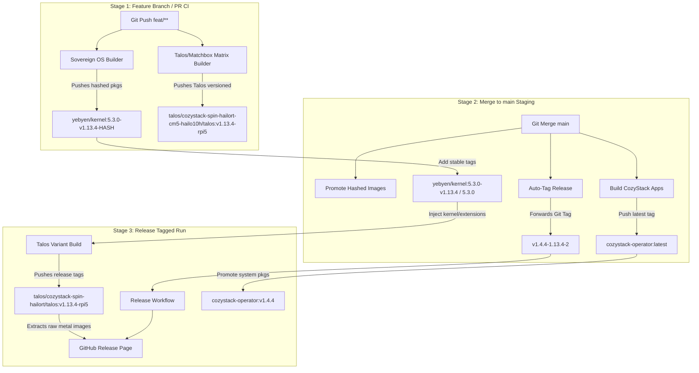

# Urmanac OCI Package Audit and Release Mapping

This document provides a comprehensive mapping of all OCI container packages published under the `urmanac` GitHub organization, distinguishing active production packages from obsolete ones, mapping the release stages, and explaining tag lifecycles.

---

## Part 1: OCI Package Audit (Active vs. Obsolete)

A registry audit was performed using `crane ls` to cross-reference compiled images from target Makefiles and CI workflows against what actually exists on GHCR.

### 1. Active Packages

The following packages are actively built and pushed by our workflows:

#### Sovereign OS Factory Packages (`ghcr.io/urmanac/cozystack-assets/yebyen/`)
Built by the Sovereign OS factory job in [.github/workflows/build-talos-images.yml](file:///Users/yebyen/u/c/cozystack-moon-and-back/.github/workflows/build-talos-images.yml) (Stage 3a):
*   `yebyen/kernel` - Custom multi-arch kernel combining official Sidero amd64 + custom signed arm64.
*   `yebyen/installer-base` - Intermediate installer-base layers.
*   `yebyen/installer` - Bootable installer containing our custom signed kernel.
*   `yebyen/imager` - Imager tool used to write and generate custom profiles.
*   `yebyen/drbd-pkg` & `yebyen/drbd` - Storage kernel extension packages.
*   `yebyen/zfs-pkg` & `yebyen/zfs` - ZFS filesystem kernel extension packages.
*   `yebyen/hailort-pkg` & `yebyen/hailort` - Hailo driver and firmware kernel extension packages.
*   `yebyen/hailo-ollama` - Special proxy application compiled via [.github/workflows/build-hailo-ollama.yml](file:///Users/yebyen/u/c/cozystack-moon-and-back/.github/workflows/build-hailo-ollama.yml).

#### Boot and Install Images (`ghcr.io/urmanac/cozystack-assets/talos/`)
*   **PR/Branch builds (matrix hardware-suffixed)**:
    - `cozystack-spin-tailscale-cm4-standard/talos` & `matchbox`
    - `cozystack-spin-tailscale-cm5-hailo10h/talos` & `matchbox`
    - `cozystack-spin-hailort-cm4-standard/talos` & `matchbox`
    - `cozystack-spin-hailort-cm5-hailo10h/talos` & `matchbox`
    - `cozystack-spin-only-cm4-standard/talos` & `matchbox`
    - `cozystack-spin-only-cm5-hailo10h/talos` & `matchbox`
*   **Release builds (clean variants)**:
    - `cozystack-spin-tailscale/talos` & `matchbox`
    - `cozystack-spin-hailort/talos` & `matchbox`
    - `cozystack-spin-only/talos` & `matchbox`

#### CozyStack Operator & System Services (`ghcr.io/urmanac/cozystack-assets/`)
*   `cozystack-operator` - Core installer operator.
*   `cozystack-packages` - System Helm package bundles stored as OCI artifacts.
*   `platform-migrations` - CozyStack database and cluster schema migrations.
*   `e2e-sandbox` - Sandbox container for running cluster end-to-end integration tests.
*   `nginx-cache` - Proxy cache helper container (`packages/apps/http-cache`).
*   `mariadb-backup` - MariaDB backup controller container (`packages/apps/mariadb`).
*   `clickhouse-backup` & `altinity-clickhouse-backup` - Clickhouse backup tools (`packages/apps/clickhouse`).
*   `ubuntu-container-disk`, `kubevirt-cloud-provider`, `kubevirt-csi-driver`, & `cluster-autoscaler` - KubeVirt cluster orchestrators (`packages/apps/kubernetes`).
*   `grafana` - System metrics visualizer (`packages/system/monitoring`).
*   `grafana-dashboards` - CozyStack Grafana dashboard configurations (`packages/system/grafana-operator`).
*   `cozystack-api` - CozyStack API server adapter.
*   `cozystack-controller` - Orchestrator reconciliation loop.
*   `backup-controller` & `backupstrategy-controller` - Volume backup services.
*   `lineage-controller-webhook` - Volume snapshot webhook.
*   `cilium` - Network security and routing layer (eBPF).
*   `kubeovn`, `kubeovn-webhook`, & `kubeovn-plunger` - Core Kube-OVN networking.
*   `kamaji` - Control-plane-as-a-service engine.
*   `multus-cni` - Multihomed pod network attachment interface.
*   `s3manager` - Storage client manager (`packages/system/bucket`).
*   `objectstorage-controller` & `objectstorage-sidecar` - COSI interface services.
*   `metallb-controller` & `metallb-speaker` - Bare metal load-balancer services.

---

### 2. Obsolete Packages (Safe to Delete)

The following registry entries are obsolete and can be deleted from GHCR with **zero outward consequences**:

| Legacy Package Path | Reason for Obsolescence |
| :--- | :--- |
| `ghcr.io/urmanac/talos-cozystack-spin-only/matchbox` | Legacy flat directory structure (replaced by `cozystack-assets/talos/cozystack-...`) |
| `ghcr.io/urmanac/talos-cozystack-spin-tailscale/matchbox` | Legacy flat directory structure |
| `ghcr.io/urmanac/talos-cozystack-spin-tailscale/talos` | Legacy flat directory structure |
| `ghcr.io/urmanac/talos-cozystack-spin-only/talos` | Legacy flat directory structure |
| `ghcr.io/urmanac/talos-cozystack-demo` | Outdated sandbox demo registry |
| `ghcr.io/urmanac/cozystack-assets/talos` | Flat staging target from experimental builds; replaced by variant paths |
| `ghcr.io/urmanac/cozystack-assets/multus` | Empty folder created by matrix; correct image is `multus-cni` |
| `ghcr.io/urmanac/cozystack-assets/bucket` | Empty folder created by matrix; correct image is `s3manager` |
| `ghcr.io/urmanac/cozystack-assets/grafana-operator` | Empty folder; correct image is `grafana-dashboards` |
| `ghcr.io/urmanac/cozystack-assets/metallb` | Empty folder; correct images are `metallb-controller` and `metallb-speaker` |
| `ghcr.io/urmanac/cozystack-assets/monitoring` | Empty folder; correct image is `grafana` |
| `ghcr.io/urmanac/cozystack-assets/http-cache` | Empty folder; correct image is `nginx-cache` |
| `ghcr.io/urmanac/cozystack-assets/clickhouse` | Empty folder; correct image is `clickhouse-backup` |
| `ghcr.io/urmanac/cozystack-assets/mariadb` | Empty folder; correct image is `mariadb-backup` |
| `ghcr.io/urmanac/cozystack-assets/kubernetes` | Empty folder; correct images are `ubuntu-container-disk` and `kubevirt-*` |
| `ghcr.io/urmanac/cozystack-assets/platform` | Empty folder; correct image is `platform-migrations` |
| `ghcr.io/urmanac/cozystack-assets/testing` | Empty folder; correct image is `e2e-sandbox` |

---

## Part 2: Release Stages & OCI Tag Mapping

### Stage 1: Feature Branch / Pull Request (CI Stage)
*   **Trigger**: Pushes to `feat/**` or PR creation targeting `main`.
*   **Workflow**: [.github/workflows/build-talos-images.yml](file:///Users/yebyen/u/c/cozystack-moon-and-back/.github/workflows/build-talos-images.yml).
*   **Stage Outputs**:
    1.  **Unique Content-Hashed Sovereign Artifacts (`yebyen/*`)**:
        - Packages (`kernel`, `installer-base`, `drbd`, etc.) are compiled and pushed to `ghcr.io/urmanac/cozystack-assets/yebyen/<name>` tagged with a unique signature `${VERSION_BASE}-${TALOS_VERSION}-${CONTENT_HASH}` (e.g. `5.3.0-v1.13.4-3d4c9177e9d4`).
        - The `CONTENT_HASH` represents a SHA256 of the patch files and build script [build-sovereign-os.sh](file:///Users/yebyen/u/c/cozystack-moon-and-back/hack/build-sovereign-os.sh) to ensure cached layers are only rebuilt when changes occur.
    2.  **Hardsuffixed Talos/Matchbox Images**:
        - Pushed to `talos/cozystack-${variant}-${hardware}/talos` and `matchbox`.
        - **Tags**: `v1.13.4` (Generic CM4) and `v1.13.4-rpi5` (RPi5/CM5) to isolate experimental builds from affecting clean release variants.
    3.  **Operator / CozyStack Apps**: Skipped in PR runs to optimize execution time and registry storage.

### Stage 2: Merge to `main` (Staging Stage)
*   **Trigger**: Pushes to `main`.
*   **Workflow**: [.github/workflows/build-talos-images.yml](file:///Users/yebyen/u/c/cozystack-moon-and-back/.github/workflows/build-talos-images.yml).
*   **Stage Outputs**:
    1.  **Stable Promotion of Sovereign OS Artifacts**:
        - Attaches stable reference tags `5.3.0-v1.13.4` and `5.3.0` to the verified hashed OCI images from the registry.
    2.  **Base CozyStack Operator & Apps**:
        - Builds system packages (`cozystack-api`, `kubeovn`, etc.) and the installer operator.
        - **Tags**: `latest`.
    3.  **Automatic Release Tag Syncing**:
        - The `update-docs-and-tag` job reads the `VERSION` file (e.g., `v1.4.4-1.13.4-2`), forcibly updates the corresponding Git tag on GitHub, and exits. This triggers the final release workflow.

### Stage 3: Release Promotion (Release Stage)
*   **Trigger**: Release tag push matching `v*` (usually automatically pushed by Stage 2).
*   **Workflow**: [.github/workflows/release-talos-assets.yml](file:///Users/yebyen/u/c/cozystack-moon-and-back/.github/workflows/release-talos-assets.yml).
*   **Stage Outputs**:
    1.  **Sovereign OS Kernel Reuse**:
        - No kernel compiles run here. The release workflow directly pulls the custom signed staging kernel and extensions from `yebyen/*` using the `5.3.0-v1.13.4` stable tags, assuring provenance.
    2.  **CozyStack Packages Promotion**:
        - Pulls the matrix-built apps and attaches the CozyStack release tag `v1.4.4` (parsed from the tag) and `latest`.
    3.  **Talos & Matchbox Image Promotion**:
        - Compiles and publishes hardware-agnostic OCI images under `talos/cozystack-${variant}/talos` and `matchbox` (without matrix suffixes).
        - **Tags**: `${TALOS_VERSION}` (e.g. `v1.13.4`), `latest` (and `*-rpi5` variants).
    4.  **Flashable Metal Raw Images**:
        - Generates flashable raw.xz images: `talos-metal-arm64-spin-hailort-talos-v1.13.4-cozy-v1.4.4.raw.xz` (both Generic and RPi5 versions).
        - Uploads the complete image assets, SHA256 checksums, and netboot kernel/initramfs files to a new GitHub Release.
